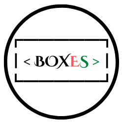

[![Contributors][contributors-shield]][https://github.com/gv211432]
[![Forks][forks-shield]][https://github.com/gv211432/boxes/network/members]
[![Stargazers][stars-shield]][https://github.com/gv211432/boxes/stargazers]
[![Issues][issues-shield]][https://github.com/gv211432/boxes/issues]
[![MIT License][license-shield]][https://github.com/gv211432/boxes/blob/main/license]

<!-- [![LinkedIn][linkedin-shield]][linkedin-url] -->

<!-- PROJECT LOGO -->
 

  
  
  <h3 align="center">boxes</h3>

  

    Print array, array of array, vector, vector of vector   and strings more beautifully👰
     
    <a href="#"><strong>Explore the docs »</strong></a>
     
     
    <a href="https://github.com/othneildrew/Best-README-Template">View Demo</a>
    ·
    <a href="https://github.com/gv211432/boxes/issues">Report Bug</a>
    ·
    <a href="https://github.com/gv211432/boxes/issues">Request Feature</a>
  

## License

[MIT](https://github.com/gv211432/boxes/blob/main/LICENSE)
