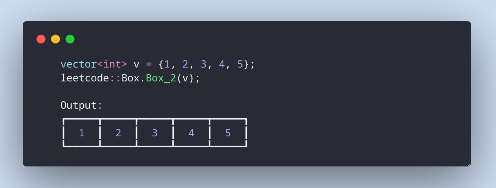
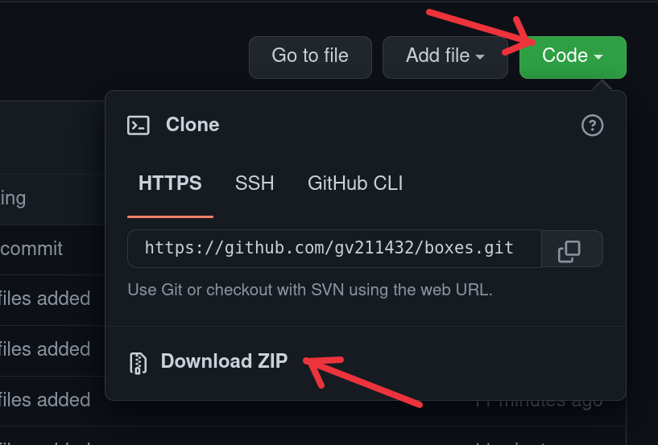
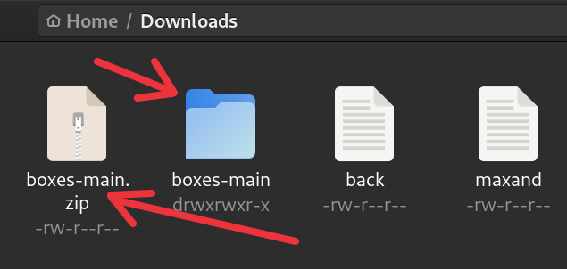
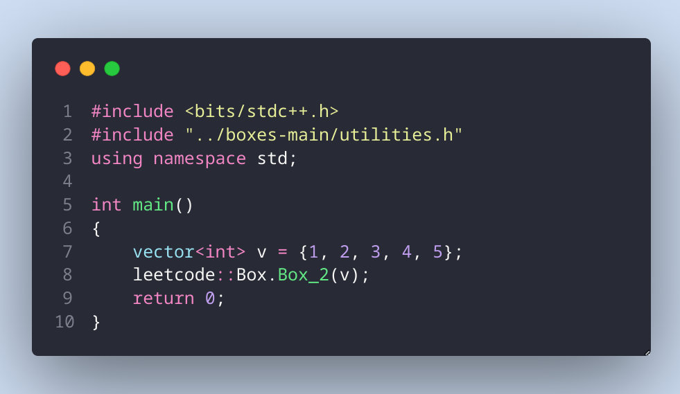
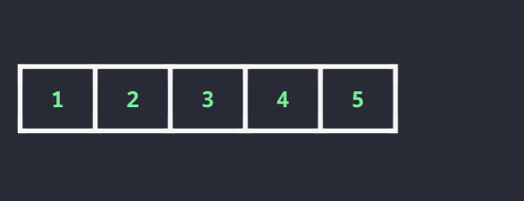
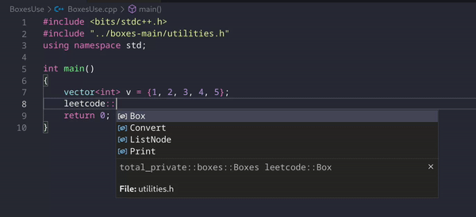
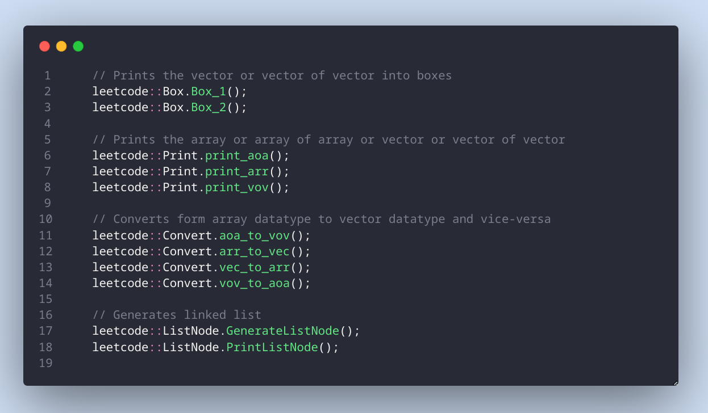
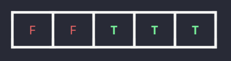
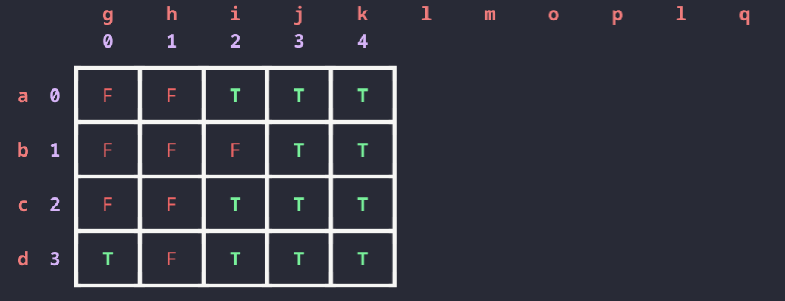

  

<!-- PROJECT LOGO -->
<br />
<div align="center">
  <a href="https://github.com/othneildrew/Best-README-Template">
    
  </a>
  
  <h3 align="center"><b>boxes</b></h3>

  <p align="center">
    Print array, array of array, vector, vector of vector <br> and strings more beautifully 👰
    <br />
    <a href="#"><strong>Explore the docs »</strong></a>
    <br />
    <br />
    <a href="https://github.com/othneildrew/Best-README-Template">View Demo</a>
    ·
    <a href="https://github.com/gv211432/boxes/issues">Report Bug</a>
    ·
    <a href="https://github.com/gv211432/boxes/issues">Request Feature</a>
  </p>
</div>

<!-- ABOUT THE PROJECT -->

## ☑️ About The Project

**Print more beautifully.**<br>
The objective of this project is to help algorithm learners to visualize the algorithms. And also help with menial tasks like printing something again and again.

_Useful 😑 for debugging purposes❗_

This project is developed by [me](https://github.com/gv211432)



## ⚙️ Installation 

<details>
 <summary><i>Click to see</i></summary>
<br>
Just download this file from above



and unzip it ....



and include it in your project.

<details>
  <summary><i>Click to open the code</i></summary>
<br>

```c++
#include <bits/stdc++.h>
#include "../boxes-main/utilities.h"
using namespace std;

int main()
{
    vector<int> v = {1, 2, 3, 4, 5};
    leetcode::Box.Box_2(v);
    return 0;
}
```

Output

```js
┏━━━━━┳━━━━━┳━━━━━┳━━━━━┳━━━━━┓
┃  1  ┃  2  ┃  3  ┃  4  ┃  5  ┃
┗━━━━━┻━━━━━┻━━━━━┻━━━━━┻━━━━━┛
```
</details>



Output



<br>
</details>


## 🧩 Modules

<details>
 <summary><i>Click to see</i></summary>
<br>

This section only shows the overview and scope of the project.



There are 4 modules in the library and more is coming soon..



<br>
</details>

## 📑 How to use 

<!-- how to section open  -->
<details>
 <summary><i>Click to see</i></summary><br>

- ### **`Box`**

Boxes used for printing `vector` or `vector of vector` or _`array`_ or _`array of array`_ of type `[int, char, bool]`. Limit of the boxes is five characters.

<br>

<!-- Boxes for vector -->
<details>
 <summary><i><b>Boxes for vector</b></i></summary>
<br>

`Box_1`
- Simple use
```c++
vector<int> v = {1, 2, 3, 4, 5};
leetcode::Box.Box_1(v);
```
Output
```c
┌─────┌─────┌─────┌─────┌─────┐ 
|  1  |  2  |  3  |  4  |  5  |
└─────┘─────┘─────┘─────┘─────┘
```
`Box_2`
<!-- one -->
- Plain use
```c++
vector<int> v = {1, 2, 3, 4, 5};
leetcode::Box.Box_2(v);
```
Output
```c
┏━━━━━┳━━━━━┳━━━━━┳━━━━━┳━━━━━┓ 
┃  1  ┃  2  ┃  3  ┃  4  ┃  5  ┃
┗━━━━━┻━━━━━┻━━━━━┻━━━━━┻━━━━━┛ 
```
<!-- two -->
- With horizontal index
```c++
vector<int> v = {1, 2, 3, 4, 5};
leetcode::Box.Box_2(v,""," ");
```
Output
```c
   1     2     3     4     5   
┏━━━━━┳━━━━━┳━━━━━┳━━━━━┳━━━━━┓ 
┃  1  ┃  2  ┃  3  ┃  4  ┃  5  ┃
┗━━━━━┻━━━━━┻━━━━━┻━━━━━┻━━━━━┛ 
```
<!-- three -->
- With horizontal index and string on top
```c++
vector<int> v = {1, 2, 3, 4, 5};
leetcode::Box.Box_2(v, "", "abcde");
```
Output
```c
   a     b     c     d     e   
   1     2     3     4     5   
┏━━━━━┳━━━━━┳━━━━━┳━━━━━┳━━━━━┓ 
┃  1  ┃  2  ┃  3  ┃  4  ┃  5  ┃
┗━━━━━┻━━━━━┻━━━━━┻━━━━━┻━━━━━┛ 
```
<!-- four -->
- Print vector of vector
```c++
vector<vector<int>> vv = {
        {1, 2, 3, 4, 5},
        {6, 7, 8, 9, 10},
        {12, 13, 14, 15, 16}};
leetcode::Box.Box_2(vv);
```
Output
```c
┏━━━━━┳━━━━━┳━━━━━┳━━━━━┳━━━━━┓ 
┃  1  ┃  2  ┃  3  ┃  4  ┃  5  ┃
┣━━━━━╋━━━━━╋━━━━━╋━━━━━╋━━━━━┫ 
┃  6  ┃  7  ┃  8  ┃  9  ┃ 10  ┃
┣━━━━━╋━━━━━╋━━━━━╋━━━━━╋━━━━━┫ 
┃ 12  ┃ 13  ┃ 14  ┃ 15  ┃ 16  ┃
┗━━━━━┻━━━━━┻━━━━━┻━━━━━┻━━━━━┛ 
```
<!-- five -->
- With vertical index
```c++
vector<vector<int>> vv = {
        {1, 2, 3, 4, 5},
        {6, 7, 8, 9, 10},
        {12, 13, 14, 15, 16}};
leetcode::Box.Box_2(vv, " ");
```
Output
```c
     ┏━━━━━┳━━━━━┳━━━━━┳━━━━━┳━━━━━┓ 
   0 ┃  1  ┃  2  ┃  3  ┃  4  ┃  5  ┃
     ┣━━━━━╋━━━━━╋━━━━━╋━━━━━╋━━━━━┫ 
   1 ┃  6  ┃  7  ┃  8  ┃  9  ┃ 10  ┃
     ┣━━━━━╋━━━━━╋━━━━━╋━━━━━╋━━━━━┫ 
   2 ┃ 12  ┃ 13  ┃ 14  ┃ 15  ┃ 16  ┃
     ┗━━━━━┻━━━━━┻━━━━━┻━━━━━┻━━━━━┛ 
```
<!-- six -->
- With vertical and horizontal index
```c++
vector<vector<int>> vv = {
        {1, 2, 3, 4, 5},
        {6, 7, 8, 9, 10},
        {12, 13, 14, 15, 16}};
leetcode::Box.Box_2(vv, " ", " ");
```
Output
```c
        0     1     2     3     4   
     ┏━━━━━┳━━━━━┳━━━━━┳━━━━━┳━━━━━┓ 
   0 ┃  1  ┃  2  ┃  3  ┃  4  ┃  5  ┃
     ┣━━━━━╋━━━━━╋━━━━━╋━━━━━╋━━━━━┫ 
   1 ┃  6  ┃  7  ┃  8  ┃  9  ┃ 10  ┃
     ┣━━━━━╋━━━━━╋━━━━━╋━━━━━╋━━━━━┫ 
   2 ┃ 12  ┃ 13  ┃ 14  ┃ 15  ┃ 16  ┃
     ┗━━━━━┻━━━━━┻━━━━━┻━━━━━┻━━━━━┛ 
```
<!-- seven -->
- With index and strings
```c++
vector<vector<int>> vv = {
        {1, 2, 3, 4, 5},
        {6, 7, 8, 9, 10},
        {12, 13, 14, 15, 16}};
leetcode::Box.Box_2(vv, "xyz", "abcde");
```
Output
```c
        a     b     c     d     e   
        0     1     2     3     4   
     ┏━━━━━┳━━━━━┳━━━━━┳━━━━━┳━━━━━┓ 
x  0 ┃  1  ┃  2  ┃  3  ┃  4  ┃  5  ┃
     ┣━━━━━╋━━━━━╋━━━━━╋━━━━━╋━━━━━┫ 
y  1 ┃  6  ┃  7  ┃  8  ┃  9  ┃ 10  ┃
     ┣━━━━━╋━━━━━╋━━━━━╋━━━━━╋━━━━━┫ 
z  2 ┃ 12  ┃ 13  ┃ 14  ┃ 15  ┃ 16  ┃
     ┗━━━━━┻━━━━━┻━━━━━┻━━━━━┻━━━━━┛ 
```
<!-- eight -->
- Print characters in boxes
```c++
vector<char> v = {'a', 'b', 'c', 'd', 'e'};
leetcode::Box.Box_2(v, " ", " ");
```
Output
```c
        0     1     2     3     4   
     ┏━━━━━┳━━━━━┳━━━━━┳━━━━━┳━━━━━┓ 
   0 ┃  a  ┃  b  ┃  c  ┃  d  ┃  e  ┃
     ┗━━━━━┻━━━━━┻━━━━━┻━━━━━┻━━━━━┛ 
```
<!-- nine -->
- Print booleans in boxes
```c++
vector<bool> v = {0, 0, 1, 1, 1};
leetcode::Box.Box_2(v);
```
Output


- Print booleans in boxes
```c++
vector<vector<bool>> vv = {
        {0, 0, 1, 1, 1},
        {0, 0, 0, 1, 1},
        {0, 0, 1, 1, 1},
        {1, 0, 1, 1, 1}};
leetcode::Box.Box_2(vv, "abcdef", "ghijklmoplq");
```
Output



<br>
<!-- boxes for vector-->
</details>

<!-- oxes for Array section open -->
<details>
 <summary><i><b>Boxes for array</b></i></summary>
<br>

`Box_1`
- Simple use
```c++
int arr[] = {1, 2, 3, 4, 5};
leetcode::Box.Box_1(arr, 5);
```
Output
```c
┌─────┌─────┌─────┌─────┌─────┐ 
|  1  |  2  |  3  |  4  |  5  |
└─────┘─────┘─────┘─────┘─────┘
```

`Box_2`
<!-- one -->
- Plain use
```c++
int arr[] = {1, 2, 3, 4, 5};
leetcode::Box.Box_2(arr, 5);
```
Output
```c
┏━━━━━┳━━━━━┳━━━━━┳━━━━━┳━━━━━┓
┃  1  ┃  2  ┃  3  ┃  4  ┃  5  ┃
┗━━━━━┻━━━━━┻━━━━━┻━━━━━┻━━━━━┛
```
<!-- two -->
- With horizontal index
```c++
int arr[] = {1, 2, 3, 4, 5};
leetcode::Box.Box_2(arr, 5, "", " ");
```
Output
```c
   1     2     3     4     5   
┏━━━━━┳━━━━━┳━━━━━┳━━━━━┳━━━━━┓ 
┃  1  ┃  2  ┃  3  ┃  4  ┃  5  ┃
┗━━━━━┻━━━━━┻━━━━━┻━━━━━┻━━━━━┛ 
```
<!-- three -->
- With horizontal index and string on top
```c++
int arr[] = {1, 2, 3, 4, 5};
leetcode::Box.Box_2(arr, 5, "", "abcde");
```
Output
```c
   a     b     c     d     e   
   1     2     3     4     5   
┏━━━━━┳━━━━━┳━━━━━┳━━━━━┳━━━━━┓ 
┃  1  ┃  2  ┃  3  ┃  4  ┃  5  ┃
┗━━━━━┻━━━━━┻━━━━━┻━━━━━┻━━━━━┛ 
```
<!-- four -->
- Print vector of vector
```c++
int aoa[3][5] = {
        {1, 2, 3, 4, 5},
        {6, 7, 8, 9, 10},
        {12, 13, 14, 15, 16}};
leetcode::Box.Box_2(*aoa, 3, 5);
```
Output
```c
┏━━━━━┳━━━━━┳━━━━━┳━━━━━┳━━━━━┓ 
┃  1  ┃  2  ┃  3  ┃  4  ┃  5  ┃
┣━━━━━╋━━━━━╋━━━━━╋━━━━━╋━━━━━┫ 
┃  6  ┃  7  ┃  8  ┃  9  ┃ 10  ┃
┣━━━━━╋━━━━━╋━━━━━╋━━━━━╋━━━━━┫ 
┃ 12  ┃ 13  ┃ 14  ┃ 15  ┃ 16  ┃
┗━━━━━┻━━━━━┻━━━━━┻━━━━━┻━━━━━┛ 
```
<!-- five -->
- With vertical index
```c++
int aoa[3][5] = {
        {1, 2, 3, 4, 5},
        {6, 7, 8, 9, 10},
        {12, 13, 14, 15, 16}};
leetcode::Box.Box_2(*aoa, 3, 5, " ");
```
Output
```c
     ┏━━━━━┳━━━━━┳━━━━━┳━━━━━┳━━━━━┓ 
   0 ┃  1  ┃  2  ┃  3  ┃  4  ┃  5  ┃
     ┣━━━━━╋━━━━━╋━━━━━╋━━━━━╋━━━━━┫ 
   1 ┃  6  ┃  7  ┃  8  ┃  9  ┃ 10  ┃
     ┣━━━━━╋━━━━━╋━━━━━╋━━━━━╋━━━━━┫ 
   2 ┃ 12  ┃ 13  ┃ 14  ┃ 15  ┃ 16  ┃
     ┗━━━━━┻━━━━━┻━━━━━┻━━━━━┻━━━━━┛ 
```
<!-- six -->
- With vertical and horizontal index
```c++
int aoa[3][5] = {
        {1, 2, 3, 4, 5},
        {6, 7, 8, 9, 10},
        {12, 13, 14, 15, 16}};
leetcode::Box.Box_2(*aoa, 3, 5, " ", " ");
```
Output
```c
        0     1     2     3     4   
     ┏━━━━━┳━━━━━┳━━━━━┳━━━━━┳━━━━━┓ 
   0 ┃  1  ┃  2  ┃  3  ┃  4  ┃  5  ┃
     ┣━━━━━╋━━━━━╋━━━━━╋━━━━━╋━━━━━┫ 
   1 ┃  6  ┃  7  ┃  8  ┃  9  ┃ 10  ┃
     ┣━━━━━╋━━━━━╋━━━━━╋━━━━━╋━━━━━┫ 
   2 ┃ 12  ┃ 13  ┃ 14  ┃ 15  ┃ 16  ┃
     ┗━━━━━┻━━━━━┻━━━━━┻━━━━━┻━━━━━┛ 
```
<!-- seven -->
- With index and strings
```c++
int aoa[3][5] = {
        {1, 2, 3, 4, 5},
        {6, 7, 8, 9, 10},
        {12, 13, 14, 15, 16}};
leetcode::Box.Box_2(*aoa, 3, 5, "xyz", "abced");
```
Output
```c
        a     b     c     d     e   
        0     1     2     3     4   
     ┏━━━━━┳━━━━━┳━━━━━┳━━━━━┳━━━━━┓ 
x  0 ┃  1  ┃  2  ┃  3  ┃  4  ┃  5  ┃
     ┣━━━━━╋━━━━━╋━━━━━╋━━━━━╋━━━━━┫ 
y  1 ┃  6  ┃  7  ┃  8  ┃  9  ┃ 10  ┃
     ┣━━━━━╋━━━━━╋━━━━━╋━━━━━╋━━━━━┫ 
z  2 ┃ 12  ┃ 13  ┃ 14  ┃ 15  ┃ 16  ┃
     ┗━━━━━┻━━━━━┻━━━━━┻━━━━━┻━━━━━┛ 
```
<!-- eight -->
- Print characters in boxes
```c++
char arr[] = {'a', 'b', 'c', 'd', 'e'};
leetcode::Box.Box_2(arr, 1, 5, " ", " ");
```
Output
```c
        0     1     2     3     4   
     ┏━━━━━┳━━━━━┳━━━━━┳━━━━━┳━━━━━┓ 
   0 ┃  a  ┃  b  ┃  c  ┃  d  ┃  e  ┃
     ┗━━━━━┻━━━━━┻━━━━━┻━━━━━┻━━━━━┛ 
```
<!-- nine -->
- Print booleans in boxes
```c++
bool arr[] = {0, 0, 1, 1, 1};
leetcode::Box.Box_2(arr, 1, 5);
```
Output


- Print booleans in boxes
```c++
bool vv[4][5] = {
        {0, 0, 1, 1, 1},
        {0, 0, 0, 1, 1},
        {0, 0, 1, 1, 1},
        {1, 0, 1, 1, 1}};
leetcode::Box.Box_2(*vv, 4, 5, "abcdef", "ghijklmoplq");
```
Output


<br>
<!-- boxex for array closed -->
</details><br>

- ### **`Print`**
 
Useful for printing arrays, vectors, array of arrays and vector of vectors.

<br>
<details>
 <summary><i><b>Print array</b></i></summary>
<br>

- Print integers
  
```c++
int arr[] = {1, 2, 3, 4, 5};
leetcode::Print.print_arr(arr, 5);
```
Output
```c
[ 1, 2, 3, 4, 5 ]
```

- Print characters
  
```c++
char arr[] = {'a', 'b', 'c', 'd', 'e'};
leetcode::Print.print_arr(arr, 5);
```
Output
```c
[ a, b, c, d, e ]
```

- Print boolean
  
```c++
bool arr[] = {0, 0, 1, 1, 1};
leetcode::Print.print_arr(arr, 5);
```
Output
```c
[ 0, 0, 1, 1, 1 ]
```

<br>
</details><br>

<details>
 <summary><i><b>Print array of array</b></i></summary>
<br>

- Print integers
  
```c++
int aoa[3][5] = {
        {1, 2, 3, 4, 5},
        {6, 7, 8, 9, 10},
        {12, 13, 14, 15, 16}};
leetcode::Print.print_aoa(*aoa, 3, 5);
```
Output
```c
[ 
[ 1, 2, 3, 4, 5 ]
[ 4, 5, 6, 7, 8 ]
[ 7, 8, 9, 10, 12 ]
]
```

- Print characters
  
```c++
char aoa[3][5] = {
    {'a', 'b', 'c', 'd', 'e'},
    {'g', 'h', 'i', 'j', 'k'},
    {'l', 'm', 'n', 'o', 'p'}};
leetcode::Print.print_aoa(*aoa, 3, 5);
```
Output
```c
[ 
[ a, b, c, d, e ]
[ d, e, g, h, i ]
[ h, i, j, k, l ]
]
```

- Print boolean
  
```c++
bool aoa[4][5] = {
        {0, 0, 1, 1, 1},
        {0, 0, 0, 1, 1},
        {0, 0, 1, 1, 1},
        {1, 0, 1, 1, 1}};
leetcode::Print.print_aoa(*aoa, 4, 5);
```
Output
```c
[ 
[ 0, 0, 1, 1, 1 ]
[ 1, 0, 0, 0, 1 ]
[ 1, 1, 0, 0, 1 ]
[ 1, 1, 1, 1, 0 ]
]
```

<br>
</details><br>

<details>
 <summary><i><b>Print vector</b></i></summary>
<br>

Print goes here

<br>
</details><br>

<details>
 <summary><i><b>Print vector of vector</b></i></summary>
<br>

Print goes here

<br>
</details><br>


- ### **`Convert`**

Useful of converting form `array` to `vector` in C++ and vice-versa. This also support `vector of vector` and `array of array`

<br>
<details>
 <summary><i>Click to see</i></summary>
<br>

Convert goes here.
Docs coming soon..


<br>
</details><br>


- ### **`LinkedList`**
<details>
 <summary><i>Click to see</i></summary>
<br>

Linkedlist goes here.
Docs coming soon..

<br>
</details><br>

<!-- how to close -->
</details>

## 💻 Advance use on with algorithms
<details>
 <summary><i>Click to see</i></summary>
<br>

Algorithms goes here

<br>
</details>

<p align="right">(<a href="#top">back to top</a>)</p>

## 📖 License 

  [MIT](https://github.com/gv211432/boxes/blob/main/LICENSE)
